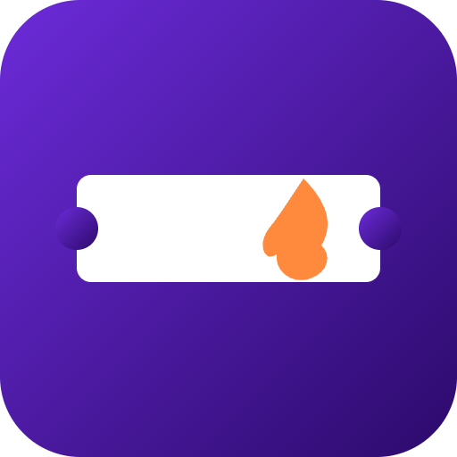

# Fanlit


**Compressed-NFT ticketing with built-in anti-scalping resale and fan rewards**

## Overview
Fanlit is an event ticketing platform built on Solana that uses compressed NFTs (cNFTs) to let independent organizers and musicians issue cheap, verifiable tickets. A built-in resale marketplace enforces price caps and splits royalties with artists, while fans earn loyalty NFTs for attending shows, unlocking perks at future events.

## Problem
Fans routinely face scalped, overpriced tickets and counterfeit duplicates. Meanwhile, organizers and artists see none of the value created when tickets are resold at inflated prices.

## Solution
Fanlit mints tickets as Solana compressed NFTs, making large-scale issuance cheap and verifiable. A built-in resale marketplace enforces a maximum resale price and automatically splits royalties between organizers and artists, turning the secondary market from a problem into a revenue stream.

## Features (MVP)
- Compressed NFT minting for low-cost ticket issuance at scale
- Built-in resale marketplace with enforced max price and royalty split
- QR-based check-in app verifying NFT ticket ownership on-chain
- Loyalty NFT badges minted to attendees after event check-in
- Organizer dashboard for ticket sales and royalty analytics

## Tech Stack
- Metaplex Bubblegum (cNFTs)
- Anchor
- React
- Phantom Wallet Adapter
- QR scanning library
- Helius RPC

## How It Works

```
[Fan Wallet] --buy--> [cNFT Ticket Mint (Bubblegum)]
       |
       v
[Resale Marketplace] --price cap & royalty split--> [Organizer/Artist]
       |
       v
[QR Check-in App] --verify ownership on-chain--> [Entry Granted]
       |
       v
[Loyalty NFT Badge Minted] --unlocks perks--> [Future Events]
```

1. Organizers create an event and mint compressed NFT tickets at low cost.
2. Fans purchase tickets directly or on the resale market, where price caps and royalty splits are enforced on-chain.
3. At the venue, the QR-based check-in app verifies NFT ownership on-chain before granting entry.
4. After check-in, attendees receive a loyalty NFT badge, unlocking perks at future events.
5. Organizers track sales, resale activity, and royalty payouts via a dashboard.

## Roadmap
- Pilot with a local indie music venue or event series
- Add secondary market integrations and mobile wallet UX polish
- Expand loyalty program into a cross-event fan rewards network

## Pitch
- [Pitch deck (PDF)](docs/pitch.pdf)
- [Pitch script](docs/pitch-script.md)

## Team
- [Name] – Role
- [Name] – Role
- [Name] – Role

Built for the Colosseum hackathon (Solana and other chains).

---

🎬 Pitch video: [docs/pitch-video.mp4](docs/pitch-video.mp4)
